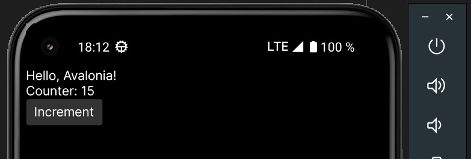

Flutter.NET

Avalonia layer for building mobile apps

Example:

```csharp
using Flutter.Widgets;

namespace Flutter.Net;

public readonly record struct MyApp : IStatelessWidget
{
    public IWidget Build(IBuildContext context)
    {
        return new Column([
            new Text("Hello, Avalonia!"),
            new CounterPage()
        ]);
    }
}

public readonly record struct CounterPage : IStatefulWidget
{
    public State CreateState() => new CounterState();
}

public class CounterState : State
{
    private int _count;

    public override IWidget Build(IBuildContext context)
    {
        return new Column([
            new Text($"Counter: {_count}"),
            new Button("Increment", Increment)
        ]);
    }

    private void Increment() => SetState(() => _count++);
}

```
Application screenshot:


