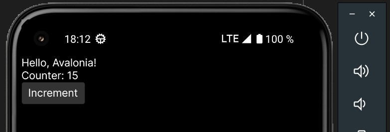

# Flutter.NET

Flutter-like UI framework in C#.

## Vision

- Keep `Widget`/`Element`/`RenderObject` architecture as close as practical to Flutter.
- Make rewriting controls from Flutter (Dart) to C# straightforward, with minimal conceptual translation.
- Reuse Avalonia mostly as platform infrastructure: app/window host, lifecycle, input plumbing, and drawing backend abstractions.
- Keep layout and paint behavior inside this framework's render layer.

## Definition of Done

1. App UI is built with Flutter-like widgets and lifecycle primitives (`StatefulWidget`, `State`, `SetState`, reconciliation).
2. Render/layout/paint behavior is framework-owned (`RenderObject`/`RenderBox`/render pipeline), not Avalonia-control-driven UI logic.
3. Samples demonstrate real framework usage via widget host flow, not only low-level render demos.
4. Core primitives are stable and close enough to Flutter semantics for practical Dart-to-C# control porting.

## Example

```csharp
using Avalonia;
using Avalonia.Media;
using Flutter.Widgets;

namespace Flutter.Net;

public sealed class MyApp : StatelessWidget
{
    public override Widget Build(BuildContext context)
    {
        return new Container(
            color: Brushes.White,
            padding: new Thickness(24),
            child: new Column(
                children:
                [
                    new Text("Hello, Flutter.NET"),
                    new SizedBox(height: 12),
                    new Text("Render tree is driven by Flutter-like widgets.")
                ]
            )
        );
    }
}
```

Application screenshot:


